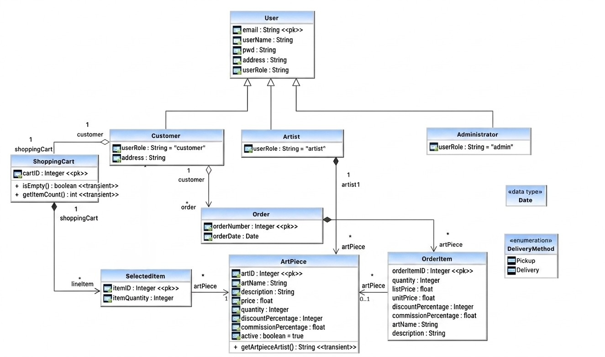

# Art Gallery — Backend Technical Documentation

> For installation instructions and running the application locally, see the [README](../README.md).
>
> For the project's development history, design changes, and evolution from the original codebase, see the [Project Evolution](../README.md#project-evolution) section of the project README.

---

# Overview

Art Gallery is a Spring Boot backend powering a multi-tier art marketplace connecting artists with customers. The backend exposes a REST API designed to support the project's web and mobile clients.

The application allows:

* Artists to list and manage artwork for sale
* Customers to browse available artwork, manage a shopping cart, and place orders
* Administrators to manage platform-level information

The backend has been substantially refactored from its original university-project implementation. The current implementation includes a refined domain model, structured request and response DTOs, service-layer validation, centralized exception handling, shopping-cart checkout, purchase history, automated testing, OpenAPI/Swagger documentation, and Docker-based deployment.

The API is currently deployed as a publicly accessible service on Northflank:

**[Online Gallery API](https://p01--art-gallery--95bbvq7j5jmw.code.run/)**

---

# Architecture

The application follows a layered backend architecture:

```text
Vue Frontend / Other Clients
          │
          ▼
   REST Controller
          │
          ▼
     Service Layer
          │
          ▼
 Repository (DAO) Layer
          │
          ▼
   PostgreSQL Database
```


The application separates HTTP handling, business logic, persistence, domain entities, and API representations into distinct layers.

## Controller Layer

`GallerySystemRestController` defines the application's HTTP routes and handles request and response mapping.

The controller:

* Receives HTTP requests from clients
* Accepts structured request DTOs
* Delegates business operations to `GallerySystemService`
* Converts domain entities into response DTOs
* Returns appropriate HTTP status codes
* Exposes API operations through REST endpoints

Request validation is supported through Bean Validation annotations on request DTOs.

Swagger/OpenAPI annotations are used to document the REST API and provide an interactive view of the available endpoints.

## Service Layer

`GallerySystemService` contains the application's business logic, including validation, entity relationships, transaction orchestration, and repository operations.

This layer enforces rules such as:

* An art piece must reference an existing artist
* A selected item must reference an existing art piece and shopping cart
* Selected quantities must be valid relative to available inventory
* A customer has one shopping cart
* Checkout converts the customer's current cart contents into an order
* Purchase information is preserved in `OrderItem` records

Keeping these rules in the service layer prevents business logic from being tied directly to HTTP requests or database operations.

## Repository (DAO) Layer

The repository layer is built using Spring Data JPA. Repository interfaces such as `ArtistRepository`, `ArtPieceRepository`, and `OrderRepository` provide access to the underlying persistence layer.

Most repository queries use **derived query methods**, which Spring Data generates automatically from method names rather than relying on hand-written SQL. For example, methods such as `findArtistByEmail` allow entities to be retrieved using their domain attributes.

## Persistence

Entities are mapped to PostgreSQL tables using JPA/Hibernate annotations.

`User` and its subtypes use the `JOINED` inheritance strategy. The concrete user types — `Customer`, `Artist`, and `Administrator` — therefore share the common `User` hierarchy while maintaining their own subtype tables.

Entity relationships are explicitly represented in the persistence model. In particular:

* A customer has one shopping cart
* A shopping cart contains selected items
* Selected items reference artwork
* An order belongs to a customer
* An order contains order items

These relationships, together with cascading and orphan-removal behavior where appropriate, help maintain data integrity across related entities.

---

# Domain Model



The domain model represents the core marketplace workflow from artwork management and shopping-cart operations through checkout and order history.

## Main Entities

| Entity           | Purpose                                                                                           |
| ---------------- | ------------------------------------------------------------------------------------------------- |
| `User`           | Base entity for users of the system; `email` is the primary key                                   |
| `Artist`         | A user who lists and sells art pieces                                                             |
| `Customer`       | A user who browses, purchases, and manages a shopping cart                                        |
| `Administrator`  | A user who manages platform-level information                                                     |
| `ArtPiece`       | A piece of art for sale, including price, quantity, discount, commission, and description         |
| `ShoppingCart`   | A customer's active cart containing selected items                                                |
| `SelectedItem`   | A shopping-cart line item representing an art piece and chosen quantity                           |
| `Order`          | A finalized purchase belonging to a customer                                                      |
| `OrderItem`      | A record of an individual item purchased as part of an order, including purchase-time information |
| `DeliveryMethod` | Enum representing the available delivery methods                                                  |

## Key Relationships

The entity relationships are structured around the distinction between a customer's **active shopping cart** and their **finalized order history**.

* Each `Customer` has **one** `ShoppingCart`.
* A `ShoppingCart` contains **many** `SelectedItem` objects.
* Each `SelectedItem` references **one** `ArtPiece`.
* An `Order` belongs to **one** `Customer`.
* An `Order` contains **many** `OrderItem` objects.
* Each `OrderItem` represents an artwork purchased as part of an order.

The `OrderItem` entity stores purchase-time information rather than relying exclusively on the current state of the associated `ArtPiece`. This allows historical orders to retain relevant information such as the artwork name, description, list price, effective unit price, discount, and commission even if the original artwork listing is subsequently modified or removed.

---

# API Design

The REST API is exposed through `GallerySystemRestController`. Request DTOs are used for client-provided data, while response DTOs are used to represent data returned to clients.

## Users

| Method | Endpoint        | Description              |
| ------ | --------------- | ------------------------ |
| `GET`  | `/user/{email}` | Retrieve a user by email |

## Customers

| Method   | Endpoint            | Description                 |
| -------- | ------------------- | --------------------------- |
| `POST`   | `/customer`         | Create a customer account   |
| `GET`    | `/customer/{email}` | Retrieve a customer         |
| `GET`    | `/customers`        | Retrieve all customers      |
| `PATCH`  | `/customer/{email}` | Partially update a customer |
| `DELETE` | `/customer/{email}` | Delete a customer           |

## Artists

| Method   | Endpoint          | Description              |
| -------- | ----------------- | ------------------------ |
| `POST`   | `/artist`         | Create an artist account |
| `GET`    | `/artist/{email}` | Retrieve an artist       |
| `GET`    | `/artists`        | Retrieve all artists     |
| `DELETE` | `/artist/{email}` | Delete an artist         |

## Administrators

| Method   | Endpoint                 | Description                     |
| -------- | ------------------------ | ------------------------------- |
| `POST`   | `/administrator`         | Create an administrator account |
| `GET`    | `/administrator/{email}` | Retrieve an administrator       |
| `DELETE` | `/administrator/{email}` | Delete an administrator         |

## Art Pieces

| Method   | Endpoint            | Description             |
| -------- | ------------------- | ----------------------- |
| `POST`   | `/artpiece`         | Create an art piece     |
| `GET`    | `/artpieces`        | Retrieve all art pieces |
| `DELETE` | `/artpiece/{artID}` | Delete an art piece     |

## Shopping Carts

| Method   | Endpoint                                 | Description                             |
| -------- | ---------------------------------------- | --------------------------------------- |
| `POST`   | `/shopping-carts/{email}`                | Create a shopping cart for a customer   |
| `GET`    | `/shopping-carts/{email}`                | Retrieve a customer's shopping cart     |
| `POST`   | `/shopping-carts/{email}/items`          | Add an art piece to the customer's cart |
| `GET`    | `/shopping-carts/{email}/items`          | Retrieve the customer's cart items      |
| `DELETE` | `/shopping-carts/{email}/items/{itemID}` | Remove an item from the cart            |
| `DELETE` | `/shopping-carts/{email}/items`          | Empty the shopping cart                 |

## Orders

| Method   | Endpoint                      | Description                                               |
| -------- | ----------------------------- | --------------------------------------------------------- |
| `POST`   | `/customers/{email}/checkout` | Checkout the customer's shopping cart and create an order |
| `GET`    | `/customers/{email}/orders`   | Retrieve all orders belonging to a customer               |
| `DELETE` | `/order/{orderNumber}`        | Delete an order                                           |

### Checkout Workflow

Order creation is exposed as a **checkout operation** rather than as a generic order-construction endpoint.

During checkout, the backend:

1. Validates the customer and their shopping cart.
2. Retrieves the selected items currently in the cart.
3. Validates that the requested artwork is still active.
4. Verifies that sufficient inventory is available.
5. Creates `OrderItem` records containing purchase-time information.
6. Decrements the corresponding artwork inventory.
7. Creates the `Order`.
8. Clears the customer's shopping cart.

This separates **temporary cart state** from **persistent order history**. The shopping cart represents the customer's current selections, while the order represents a completed purchase.

---

# DTO Design

The REST layer uses Data Transfer Objects (DTOs) to separate the API representation from the underlying JPA persistence model.

## Request DTOs

Request DTOs define the information accepted from clients and provide declarative input validation using Bean Validation annotations.

Client-provided resource data is submitted through structured request bodies rather than relying on URL parameters for request data.

For example, `SelectedItemRequestDto` accepts:

* `artID` — the artwork being added to the cart
* `quantity` — the requested quantity

Both fields are required and must contain valid positive values.

## Response DTOs

Response DTOs expose information required by the client without directly serializing JPA entities.

For example, `ArtPieceDto` represents an artwork returned by the API and includes information such as:

* Artwork ID
* Name
* Price
* Available quantity
* Discount
* Commission percentage
* Description
* Associated artist

Using dedicated response DTOs prevents the persistence model and its internal relationships from being exposed directly through JSON serialization.

---

# Error Handling

The API uses centralized exception handling to provide consistent HTTP error responses.

The global exception handler currently handles:

* Invalid business or request arguments — `400 Bad Request`
* Request validation failures — `400 Bad Request`
* Missing resources — `404 Not Found`
* Unexpected server errors — `500 Internal Server Error`

Validation failures provide both a human-readable summary and field-level validation messages where applicable.

Centralizing exception handling keeps error behavior consistent across REST endpoints and prevents individual controller methods from having to implement repetitive error-handling logic.

---

# Capabilities by Role

## Artist

* Register an account
* Create and manage artwork listings
* Set artwork price, inventory quantity, discount, and commission
* Provide artwork descriptions
* View available artwork
* Remove artwork

## Customer

* Register an account
* Browse available artwork
* Create and manage a shopping cart
* Add artwork to the cart
* Specify quantities
* Remove individual cart items
* Empty the shopping cart
* Validate requested quantities against available inventory
* Checkout and create an order
* Retrieve previous orders

## Administrator

* Register an account
* View and manage platform-level information

---

# Data Validation & Integrity

The service and API layers enforce validation and data-integrity rules on write operations.

These include:

* Required text fields such as username, email, password, address, artwork name, and description are trimmed and rejected when blank.
* Email fields are validated against a standard email format.
* Email uniqueness is enforced across user types because `email` is the shared primary key in the user hierarchy.
* Foreign-key references, such as an artwork's artist or a selected item's artwork and shopping cart, are verified before dependent entities are created.
* Selected-item quantities are checked against available artwork inventory.
* Required entity relationships are validated before dependent entities are persisted.
* Request DTOs apply declarative validation constraints before invalid requests reach the service layer.
* Service-layer validation provides explicit application exceptions rather than allowing invalid relationships or null references to result in unexpected failures.

Data integrity has been a major focus of the backend refactoring. Entity relationships, persistence behavior, deletion operations, and service-layer validation have been tested and hardened throughout the project's evolution.

---

# Testing Strategy

The backend has been tested at multiple levels to validate both individual business rules and complete application behavior.

## Unit Tests

Service-layer tests use **JUnit 5** and **Mockito** to test business logic in isolation. Repository dependencies are replaced with mocks using `@Mock` and `@InjectMocks`, allowing validation and service behavior to be tested without requiring a database.

The service tests cover:

* Successful entity creation
* Null and blank input validation
* Email format validation
* Whitespace trimming
* Duplicate user email handling
* Missing referenced entities
* Invalid quantities and numeric values
* Regression cases for previously identified service-layer defects

Shopping-cart tests also verify that newly created carts correctly initialize their selected-item collections and can subsequently accept cart items.

## Persistence and Integration Tests

Persistence tests use `@SpringBootTest` and `@ExtendWith(SpringExtension.class)` to start the actual Spring application context and exercise the real JPA repositories.

Unlike service-layer unit tests, these tests do **not** mock repository dependencies. They verify behavior across:

```text
JUnit Test
    │
    ▼
Spring Application Context
    │
    ▼
Spring Data JPA / Hibernate
    │
    ▼
PostgreSQL
```

These tests validate:

* Entity-to-table mappings
* Primary and foreign-key relationships
* JPA inheritance mappings
* Repository queries
* Entity creation and retrieval
* Entity deletion
* Cascade and orphan-removal behavior
* Persistence behavior across related entities
* Database integrity constraints

Repository deletion tests, for example, create actual persisted entities and verify that repository operations result in the expected database state.

## Controller Integration Tests

The REST API is also exercised through HTTP requests against the Spring controllers.

Controller integration tests verify complete request and response behavior, including:

* Request validation
* HTTP status codes
* Request DTO handling
* Response DTO conversion
* Error responses
* Controller-to-service integration

This provides coverage beyond isolated service or persistence behavior by testing the API boundary used by client applications.

## Regression Testing

When a defect is identified, the preferred approach is to reproduce it with a test, correct the underlying implementation or mapping, and retain the test as a regression case.

This approach has been particularly valuable during the modernization of the original codebase, where earlier implementations contained defects in entity relationships, validation, persistence behavior, and API handling.

## Running Tests

Run the complete test suite with:

```bash
./gradlew test
```

On Windows PowerShell:

```powershell
.\gradlew.bat test
```

A specific test class can be run with:

```powershell
.\gradlew.bat test --tests "ca.mcgill.ecse321.gallerysystem.service.TestCreateArtist"
```

Gradle generates an HTML test report at:

```text
build/reports/tests/test/index.html
```

The test suite covers unit, persistence, and REST integration behavior and is used to validate both normal application flows and invalid or exceptional inputs.

---

# API Documentation

The REST API is documented using **OpenAPI/Swagger** annotations.

Once the application is running, the generated API documentation can be accessed through the Swagger UI.

The API documentation describes:

* Available REST endpoints
* HTTP methods
* Request bodies
* Response types
* Endpoint descriptions

Swagger UI also provides an interactive interface for inspecting and exercising the available API operations.

The deployed API is publicly accessible at:

**https://p01--art-gallery--95bbvq7j5jmw.code.run/**

---

# Containerization & Deployment

The backend is containerized using **Docker**.

The Docker configuration packages the Spring Boot application and its runtime dependencies into a portable container image. PostgreSQL is provided as a separate service during local development through Docker Compose.

This creates a consistent development and deployment environment and avoids requiring developers to install and configure PostgreSQL directly on their machines.

## Local Container Architecture

The local environment consists of:

```text
Docker Compose
     │
     ├───────────────┐
     ▼               ▼
Spring Boot      PostgreSQL
Container        Container
     │               │
     └───────┬───────┘
             │
             ▼
          Port 8080
```

The standard local workflow is:

```bash
docker compose up
```

To stop the services:

```bash
docker compose down
```

To remove the database volume as well:

```bash
docker compose down -v
```

The Docker Compose configuration supplies the database connection information to the Spring Boot container through environment variables.

Running the application directly with Gradle remains possible for development and debugging:

```bash
./gradlew bootRun
```

However, Docker Compose is the recommended standard setup for running the complete backend environment locally.

## Production Deployment

The backend is deployed using **Northflank** as a continuously running containerized service.

Northflank builds and deploys the application's Docker image and provides the public networking required to expose the Spring Boot API. Northflank supports Dockerfile-based builds directly from connected Git repositories and provides runtime environment variables for deployment configuration.

The production database is hosted separately from the application container. Database credentials and connection information are supplied through runtime environment variables rather than committed to the repository.

The deployed API is available at:

```text
https://p01--art-gallery--95bbvq7j5jmw.code.run/
```

The current deployed service responds successfully at the root endpoint.

---

# Technology Stack

| Layer             | Technology                                   |
| ----------------- | -------------------------------------------- |
| Backend           | Spring Boot / Java                           |
| Database          | PostgreSQL                                   |
| Persistence       | Spring Data JPA / Hibernate                  |
| Build Tool        | Gradle                                       |
| API               | REST                                         |
| API Documentation | OpenAPI / Swagger                            |
| Testing           | JUnit 5, Mockito, Spring integration testing |
| Frontend          | Vue.js                                       |
| Containerization  | Docker / Docker Compose                      |
| Hosting           | Northflank                                   |

---

# Project Evolution

The backend originated as part of the ECSE 321 — Introduction to Software Engineering course project at McGill University in Fall 2020.

Since the original project, the backend has been independently maintained and substantially refactored.

Major improvements include:

* **Refactored the domain model** to enforce appropriate entity relationships and improve data integrity
* **Added an `OrderItem` entity** to support checkout and preserve purchase-time order information
* **Implemented shopping-cart checkout and order history**
* **Added purchase-time snapshots** of price and artwork information to order items
* **Refactored API endpoints** to use structured request bodies and request DTOs
* **Added Bean Validation** to API request objects
* **Refactored API responses** to use dedicated response DTOs rather than exposing JPA entities
* **Added centralized global exception handling** with structured error responses
* **Hardened service-layer validation**, replacing failure-prone null handling and unexpected exceptions with explicit application exceptions
* **Improved data-integrity handling** across entity relationships and deletion operations
* **Built a comprehensive automated test suite** covering unit, persistence, and controller integration behavior
* **Added OpenAPI/Swagger documentation** to the REST API
* **Containerized the backend and PostgreSQL development environment** using Docker and Docker Compose
* **Deployed the backend API to Northflank**

The current backend therefore represents a substantially refactored and extended version of the original course-project implementation.

For the complete development history, see the [Project Evolution](../README.md#project-evolution) section of the README.

---

# Project Status

**Backend:** Feature-complete, containerized, tested, documented, and deployed as a publicly accessible API.

**Frontend:** The original Vue.js frontend remains separate from the backend and requires further modernization to align with the current API.

**Deployment:** The Spring Boot API is hosted on Northflank and is publicly accessible.

**API:** The core marketplace API — including artwork management, user management, shopping carts, checkout, and order history — is functional and deployed.

---

# Future Improvements

The primary remaining work is focused on authentication, frontend modernization, and production-oriented improvements rather than fundamental backend functionality.

Potential future work includes:

* **Add authentication and authorization** for secure user authentication and role-based access control
* **Further modernize the Vue.js frontend** to align with the current API
* **Expand automated testing** as authentication and frontend/API integration are introduced
* **Add production health checks and monitoring**
* **Further refine API documentation** with more detailed endpoint descriptions and examples
* **Improve deployment and operational configuration** as the application evolves toward a more production-ready system
