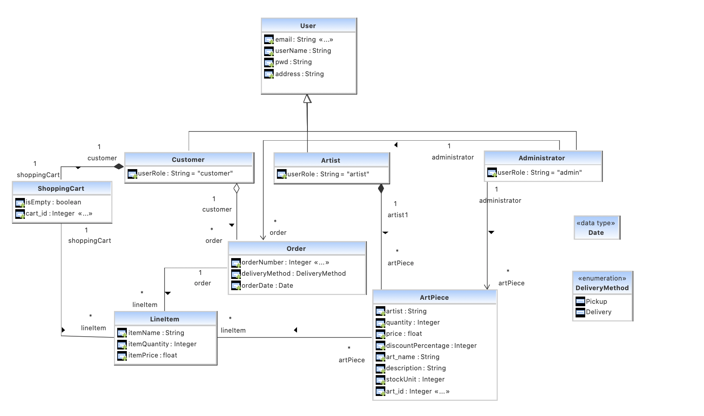

# Art Gallery — Backend Technical Documentation

> For installation instructions and running the application locally, see the [README](../README.md).

---

# Overview

Art Gallery is a Spring Boot backend powering a multi-tier art marketplace connecting artists with customers. The backend exposes a REST API consumed by both a web frontend and an Android client.

The application allows:

- Artists to list and manage art pieces for sale
- Customers to browse art, manage a shopping cart, and place orders
- Administrators to oversee the platform

---

# Architecture

The application follows a layered architecture:

```
Client (Web / Android)
        │
        ▼
  REST Controller
        │
        ▼
   Service Layer
        │
        ▼
 Repository (DAO) Layer
        │
        ▼
  PostgreSQL Database
```


## Controller Layer

`GallerySystemRestController` defines the application's HTTP routes and handles request/response mapping for every entity in the system.

## Service Layer

`GallerySystemService` contains the application's business logic: input validation, entity relationships, and orchestration of repository calls. This is where rules such as "an art piece must belong to a real artist" or "a shopping cart's items must be tracked correctly" are enforced.

## Repository (DAO) Layer

Built on Spring Data JPA. Each entity has a corresponding repository interface (e.g. `ArtistRepository`, `ArtPieceRepository`) extending `CrudRepository`. Most queries are Spring Data **derived query methods** — generated automatically from method names (e.g. `findArtistByEmail`) — rather than hand-written SQL.

## Persistence

Entities are mapped to PostgreSQL tables using JPA/Hibernate annotations. `User` and its subtypes use the `JOINED` inheritance strategy, meaning each user type has its own table sharing a common primary key (`email`) with a base `users` table.

---

# Domain Model


## Main Entities

| Entity | Purpose |
|---|---|
| `User` | Abstract base entity; `email` is the primary key |
| `Artist` | A user who lists and sells art pieces |
| `Customer` | A user who browses, purchases, and manages a shopping cart |
| `Administrator` | A user who manages the platform |
| `ArtPiece` | A piece of art for sale — price, quantity, discount, and commission percentage |
| `ShoppingCart` | One per customer; holds selected items |
| `SelectedItem` | A line item: an `ArtPiece` plus a chosen quantity |
| `Order` | A finalized purchase, linking a customer, a shopping cart, and a date |
| `DeliveryMethod` | Enum: `pickup` or `delivery` |

---

# API Design

The API follows a consistent CRUD pattern per entity: create, retrieve (single/all), and delete endpoints for each of `Artist`, `Customer`, `Administrator`, `ArtPiece`, `ShoppingCart`, `SelectedItem`, and `Order`.

| Resource                | Method   | Endpoint                    | Description                            |
| ----------------------- | -------- | --------------------------- | -------------------------------------- |
| **Artists**             | `POST`   | `/artists`                  | Create an artist account               |
|                         | `GET`    | `/artists/{email}`          | Retrieve an artist                     |
|                         | `GET`    | `/artists`                  | Retrieve all artists                   |
|                         | `DELETE` | `/artists/{email}`          | Delete an artist                       |
| **Customers**           | `POST`   | `/customers`                | Create a customer account              |
|                         | `GET`    | `/customers/{email}`        | Retrieve a customer                    |
|                         | `GET`    | `/customers`                | Retrieve all customers                 |
|                         | `DELETE` | `/customers/{email}`        | Delete a customer                      |
| **Administrators**      | `POST`   | `/administrators`           | Create an administrator account        |
|                         | `GET`    | `/administrators/{email}`   | Retrieve an administrator              |
|                         | `GET`    | `/administrators`           | Retrieve all administrators            |
|                         | `DELETE` | `/administrators/{email}`   | Delete an administrator                |
| **Art Pieces**          | `POST`   | `/artpieces`                | Create an art piece                    |
|                         | `GET`    | `/artpieces/{id}`           | Retrieve an art piece                  |
|                         | `GET`    | `/artpieces`                | Retrieve all art pieces                |
|                         | `DELETE` | `/artpieces/{id}`           | Delete an art piece                    |
| **Shopping Carts**      | `POST`   | `/shoppingcarts`            | Create a shopping cart                 |
|                         | `GET`    | `/shoppingcarts/{email}`    | Retrieve a customer's shopping cart    |
|                         | `GET`    | `/shoppingcarts`            | Retrieve all shopping carts            |
|                         | `DELETE` | `/shoppingcarts/{id}`       | Delete a shopping cart                 |
| **Selected Items**      | `POST`   | `/selecteditems`            | Create a selected item                 |
|                         | `GET`    | `/selecteditems`            | Retrieve all selected items            |
|                         | `DELETE` | `/selecteditems/{id}`       | Delete a selected item                 |
| **Shopping Cart Items** | `POST`   | `/shoppingcarts/{id}/items` | Add a selected item to a shopping cart |
| **Orders**              | `POST`   | `/orders`                   | Create an order                        |
|                         | `GET`    | `/orders/{orderNumber}`     | Retrieve an order                      |
|                         | `GET`    | `/orders`                   | Retrieve all orders                    |
|                         | `DELETE` | `/orders/{orderNumber}`     | Delete an order                        |


## Capabilities by Role

### Artist
- Register an account
- Create, view, and remove art pieces

### Customer
- Register an account
- Browse all available art pieces
- Add items to a shopping cart
- Place an order with a chosen delivery method

### Administrator
- Register an account
- View and manage platform users

---

# Data Validation & Integrity

The service layer enforces the following rules on write operations:

- All required text fields (username, email, password, address, art piece name/description) are trimmed and rejected if blank
- Email fields are validated against a standard email format
- Email uniqueness is enforced across all user types, since `email` is the shared primary key
- Foreign key references (e.g. an art piece's artist, a selected item's art piece) are verified to exist before the referencing entity is created
- Selected item quantity is checked against the art piece's available stock

This validation layer has been an active area of hardening — several gaps (silent null relationships, unvalidated duplicate emails, unbounded numeric inputs) have been identified and fixed through manual API testing and expanded automated test coverage.

---


# Testing Strategy

The project uses two complementary testing approaches: **service-layer unit tests** and **persistence/integration tests**.

## Unit Tests

Service-layer tests use **JUnit 5** and **Mockito** to test business logic in isolation. Repository dependencies are replaced with mocks using `@Mock` and `@InjectMocks`, allowing validation and service behavior to be tested without requiring a database.

The service tests cover:

* Successful entity creation
* Null and blank input validation
* Email format validation
* Whitespace trimming
* Duplicate user email handling
* Missing referenced entities
* Invalid quantities and numeric values
* Regression cases for previously identified service-layer bugs

For example, the shopping cart tests verify that a newly created cart initializes its selected-item collection correctly, preventing failures when items are subsequently added.

## Persistence and Integration Tests

The repository-level tests use `@SpringBootTest` and `@ExtendWith(SpringExtension.class)` to start the actual Spring application context and exercise the real JPA repositories.

Unlike the service tests, these tests do **not** mock the repositories. They verify behavior across:

```text
JUnit Test
    │
    ▼
Spring Application Context
    │
    ▼
Spring Data JPA / Hibernate
    │
    ▼
PostgreSQL
```

This makes the persistence tests particularly useful for validating:

* Entity-to-table mappings
* Primary and foreign key relationships
* JPA inheritance mappings
* Repository queries
* Entity creation and deletion
* Cascade and orphan-removal behavior
* Persistence behavior across related entities

Repository deletion tests, for example, create actual persisted entities and verify that repository operations produce the expected database state.

## Regression Testing

When a defect is identified, the preferred approach is to reproduce it with a test, correct the underlying implementation or mapping, and retain the test as a regression case.

This has been particularly useful while modernizing the original codebase, where several tests and entity mappings were based on earlier versions of the service API.

## Running Tests

Run the complete test suite with:

```bash
./gradlew test
```

On Windows PowerShell:

```powershell
.\gradlew.bat test
```

A specific test class can be run with:

```powershell
.\gradlew.bat test --tests "ca.mcgill.ecse321.gallerysystem.service.TestCreateArtist"
```

Gradle generates an HTML test report at:

```text
build/reports/tests/test/index.html
```

## Current Coverage

Test coverage is actively being rebuilt and expanded. Current work prioritizes:

1. Service-layer validation and business rules
2. Entity creation and retrieval
3. Repository persistence and deletion behavior
4. Shopping cart and selected-item relationships
5. Order workflows
6. End-to-end REST integration testing

The test suite should therefore be considered **actively evolving rather than complete**.

# Known Limitations

Known gaps include:

- Percentage fields (discount, commission) validate against negative values but not against unrealistic upper bounds
- Password fields have no minimum length or complexity requirement
- Some legacy repository/service methods contain naming inconsistencies inherited from earlier iterations of the project

---

# Future Improvements

- Complete validation and test coverage across all remaining service methods
- Enforce upper-bound checks on percentage-based fields
- Expand integration testing across the full request lifecycle